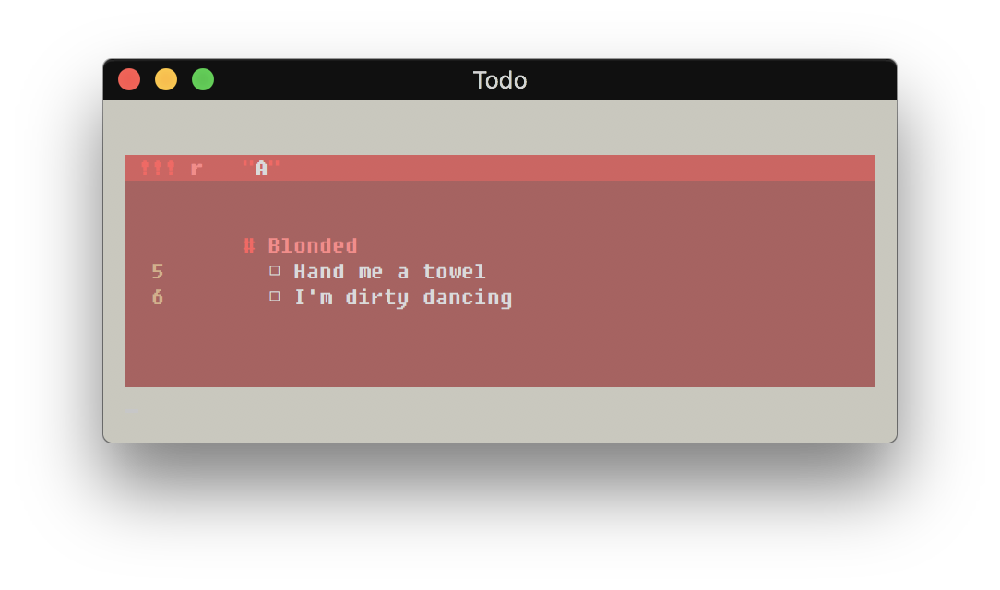

# Todo
Todo is a simple and intuitive manager for TODO lists, allowing you to organize your life, or maybe just programming projects, from the terminal in a way that feels natural and looks stylish!

## Disclaimer
Before moving on, it wouldn't be fair of me to continue without mentioning and crediting the inspiration behind the project. Upon watching a completely unrelated video for better window switching in i3wm by the fantastic [Budlabs](https://www.youtube.com/channel/UCi8XrDg1bK_MJ0goOnbpTMQ) (who, by the way, is a must-watch for anyone learning i3), I happened to notice this TODO list off to the side:

<p align="center">
  
</p>

I liked it so much that after failing to find any mention of it after listening to the video, reading the comments and his blog, and even scouring the AUR, I decided to make it.

Aside from some different colors, I wanted to keep the overall design essentially the same given the wonderful layout of the original.

So thank you Budlabs for not only teaching me everything I now know about i3, but also for inspiring me to make something as functional and useful as a TODO list!

## Setup
### Todo Repository
Prior to usage, you must first initialize the Todo directory as a proper Todo repository:

```sh
$ todo init
```

This will create a *.todo* file which will store all data relevant to any projects, sections, or tasks you create.

### Alias
As an optional step, it is recommended that you create an alias to the script within *.bashrc*, *.bash_aliases*, or your respective shell configuration file. For example, if I installed the script to */opt/todo*, I could add the following line:

```sh
alias todo='python3 /opt/todo/todo.py'
```

## Usage
Todo has 4 main modes:

### Normal
View or modify existing projects and sections.

```sh
$ todo [PROJECT [SECTION]]
```

#### Display
When executed with no arguments, Todo will display all existing projects, sections, and tasks:

<p align="center">
  
</p>

When passed a project's or section's name, the output is adjusted to only show that specific project or section:

<p align="center">
  
</p>

#### Options
You can add tasks:

```sh
$ todo [PROJECT [SECTION]] -a "Task 1"
```
- To add a section task, simply specify the section name within the command and the task will automatically be added to the section if it exists.

You can delete tasks:

```sh
$ todo [PROJECT] -d TASK
```
  - As of this release, deleting tasks requires inputting the task's position, not it's normal label. 

You can check and uncheck tasks:

```sh
$ todo [PROJECT] -c "Task 1"
$ todo [PROJECT] -u "Task 1"
```

You can add or delete sections:

```sh
$ todo [PROJECT] -sa "Section 1"
$ todo [PROJECT] -sd "Section 1"
```

### Creation
Create projects.

```sh
$ todo create "Project1"
```
- As of this release, project names may only contain alphanumerics and no spaces.

Currently, only 3 colors are in rotation for projects (red, green, blue). And though that may change at a future date, let's be honest, if you're working on more than 3 projects then you're kind of spreading yourself out thin!


### Deletion
Delete projects.

```sh
$ todo delete "Project1"
```


### Archive
Delete completed tasks.

```sh
$ todo archive [PROJECT [SECTION]] 
```

When executed with no arguments, Todo will archive all completed tasks in all projects. This can, of course, be adjusted by project or section depending on the arguments passed.