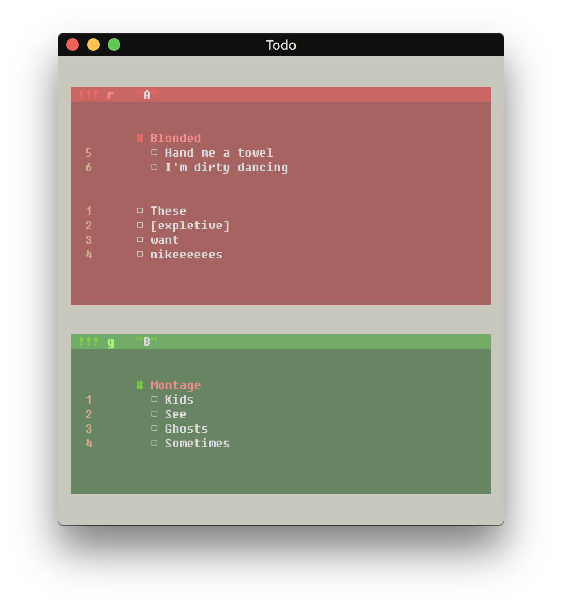

# Todo
Todo is a simple and intuitive manager for TODO lists, allowing you to organize your life, or maybe just programming projects, from the terminal in a way that feels natural and looks stylish!

<p align="center">
  
</p>


## Disclaimer
Before moving on, it wouldn't be fair of me to continue without mentioning and crediting the inspiration behind the project. Upon watching a completely unrelated video for better window switching in i3wm by the fantastic [Budrich](https://www.youtube.com/channel/UCi8XrDg1bK_MJ0goOnbpTMQ) (who, by the way, is a must-watch for anyone learning i3), I instantly noticed a snazzy TODO list off to the side.

I liked it so much that after failing to find any mention of it after listening to the video, reading the comments and his blog, and even scouring the AUR, I decided to make it. Aside from some different colors, I wanted to keep the overall look essentially the same given the wonderful layout of the original.

I later found out that the TODO list was a Sublime Text 3 package called [PlainNotes](https://github.com/aziz/PlainNotes) (so much for scouring the AUR), so thanks to aziz for making something so fantastic! I hope you're okay with me stealing a bit of your design.


## Setup
As an optional step, it is recommended that you create an alias to the script within *.bashrc*, *.bash_aliases*, or your respective shell configuration file. For example, if I installed the script to */opt/todo*, I could add the following line:

```sh
alias todo='python3 /opt/todo/todo.py'
```

## Usage
Todo has 4 main modes:

### Normal
View or modify existing projects and sections.

```sh
$ todo [PROJECT [SECTION]]
```

#### Display
When executed with no arguments, Todo will display all existing projects, sections, and tasks:
```sh
$ todo
```
<p align="center">
  
</p>

When passed a project's or section's name, the output is adjusted to only show that specific project or section:
```sh
$ todo A Blonded
```
<p align="center">
  
</p>

#### Options
To add or delete tasks:
```sh
$ todo PROJECT [SECTION] -a "Task 1"
$ todo PROJECT -d ID₁ ID₂ ...
```

To check and uncheck tasks:
```sh
$ todo PROJECT -c "Task 1" "Task 2" ...
$ todo PROJECT -u "Task 1" "Task 2" ...
```

To move tasks:
```sh
$ todo PROJECT -mp "Task To Move" NEW_PROJECT
$ todo PROJECT -ms "Task To Move" NEW_PROJECT NEW_SECTION
```

To add or delete sections:
```sh
$ todo PROJECT -sa "Section 1"
$ todo PROJECT -sd "Section 1"
```

To rename projects and sections:
```sh
$ todo PROJECT [SECTION] -r "New Name"
```

### Creation
Create projects.
```sh
$ todo create Project1
```
- As of this release, project names may only contain alphanumerics and no spaces.

- Currently, only 4 colors are in rotation for projects (red, green, blue, violet), though that may change at a future date.


### Deletion
Delete projects.
```sh
$ todo delete Project1
```


### Archive
Remove completed tasks.
```sh
$ todo archive [PROJECT [SECTION]] 
```

- When executed with no arguments, Todo will archive all completed tasks in all projects.